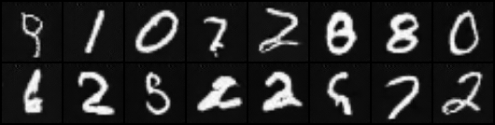

# CSCE 790 Neural Networks and Their Applications Homework 2 Report

Author: Titon Barua <baruat@email.sc.edu>

## Part A

### Rumelhart, D.E., Hinton, G.E. and Williams, R.J., 1986. Learning representations by back- propagating errors. Nature, 323(6088), pp.533-536.

This paper is the seminal work that brought back-propagation (a.k.a. automatic
differentiation) into the mainstream in the context of neural network training.
To summarize the algorithm described in the paper -

1. For a set a of training inputs and labels, do forward computations to get a
   prediction. Make sure to save all the intermediate computations.
2. Calculate the difference between true labels vs the predictions using some
   metric. This is the error.
3. Calculate derivative of the error with respect to the prediction. From this,
   gradually calculate derivatives of the inner layers of the network using
   chain rule.
4. The key observation is that, the gradient of a weight in a particular layer
   is a linear function of the inputs from inner layer and the back-propagated
   gradient from outer layer.
5. Using functional dependency relation of neuron's output to it's input, the
   gradient chain can be linked all the way to the network input.
6. Iteratively adjust all weights in the opposite direction of their gradients
   until convergence.

### LeCun, Y.A., Bottou, L., Orr, G.B. and Müller, K.R., 2012. Efficient backprop. In Neural networks: Tricks of the trade (pp. 9-48). Springer, Berlin, Heidelberg.

This paper describes some heuristics and tricks to improve performance of
standard back-propagation. Most of the techniques described here is still widely
used and is pretty relevant.

1. In section `4.1` The authors present stochastic, batch and mini-batch
   approaches to gradient descent. They go-through pros and cons of all three
   methods.
2. Section `4.2` focuses on importance of sample randomization. With randomized
   input order, the chance of a network falling into a local optima is greatly
   reduced.
3. Section `4.3` describes data normalization. The authors suggests the input
   samples to be normalized close to zero. Also, they recommend to scale
   different components of the input vector to have identical covariance.
4. In section `4.6`, the authors describe a particular approach to weight
   initialization. They recommend to sample from a uniform distribution with
   zero mean.
5. Section `4.7` discusses learning rates and momentum.

The paper also goes over ineffectiveness of some classical optimization
algorithms in the context of training a neural network.

## Part B

### Section 1 and 2

I have implemented a general framework for simple multi-layer perceptrons, along
with hand-rolled back-propagation, using numpy. The network class `MLP`, along
with some routines for training is implemented inside the
[network.py](https://github.com/titonbarua/coursework--csce790/blob/main/homework_2/network.py)
file. `MLP` class can be invoked with a sequence of layer specifications to
configure network topology and complexity. The file also contains two simple
neural networks as test cases.

Initially I implemented the back-propagation algorithm using various matrix
operations offered in numpy. Later, I found einstein-summation notation to be
simpler and re-implemented some parts using this generalized operation.

The single layer network of section 1 is implemented in
[one\_layer\_classifier.py](https://github.com/titonbarua/coursework--csce790/blob/main/homework_2/one_layer_classifier.py).

\pagebreak

The double layer regression network in implemented in
[two\_layer\_regression.py](https://github.com/titonbarua/coursework--csce790/blob/main/homework_2/two_layer_regression.py).

\pagebreak

### Section 3

The article describes creating an standard multi-head attention transformer for
sequence to sequence mapping. The task was to map a randomly generated sequence
of size $(64, 100)$ to another randomly generated sequence of size $(64, 100)$.
The proposed model uses a 8-head, 512 neuron-wide attention mechanism. The whole
model employs 6 encoder and 6 decoder stages.

Both the source and the target vocabulary was 5000. Verbatim copy of the code is
available
[here](https://github.com/titonbarua/coursework--csce790/blob/main/homework_2/transformer.py).
The training session standard output is available
[here](https://github.com/titonbarua/coursework--csce790/blob/main/homework_2/transformer_stdout.txt).

### Section 4

This article describes generative adversarial networks(GAN) in detail. All the
code used in the article is available [here](https://github.com/diegoalejogm/gans).
I simply cloned the repository and ran the jupyter notebooks in my local machine
to generate the results.

Vanilla GAN was relatively inexpensive to compute compared to DCGAN. VGAN ran
for full 200 epochs. I had to forcefully stop training for DCGAN at 50 epochs.
Samples generated by DCGAN were much more visually pleasant.

Generated samples by Vanilla GAN after training for 0, 10, 25 and 50
epochs:

\
\
\

\pagebreak

Generated samples by DCGAN after training for 0, 10, 25 and 50 epochs:

\
\
\

\pagebreak

### Part C

Let us define the symbols for the 2-layer feed-forward NN,

$$\begin{split}
i &= \text{The network input size}\\
h &= \text{Number of neurons in first(hidden) layer}\\
o &= \text{Number of neurons in second(output) layer}\\
\prescript{h \times i}{}W_1 &= \text{Weight matrix of size (h×i) for hidden layer}\\
\prescript{h \times 1}{}b_1 &= \text{Bias vector of size (h×1) for hidden layer}\\
\prescript{o \times h}{}W_2 &= \text{Weight matrix of size (o×h) for output layer}\\
\prescript{o \times 1}{}b_2 &= \text{Bias vector of size (o×1) for output layer}\\
\prescript{o \times 1}{}E' &= \text{The gradient of the loss function as a matrix of size (o×1)}\\
\prescript{i \times 1}{}X_1 &= \text{Input vector of size (i×1)}\\
\prescript{o \times 1}{}Y_2 &= \text{Output vector of size (o×1)}\\
\end{split}
$$

For clarity, let's brake-up the forward computation into steps.

$$\begin{split}
\prescript{h \times 1}{}Z_1 &= \prescript{h \times i}{}W_1.\prescript{i \times 1}{}X_1
                               + \prescript{h \times 1}{}b_1 \qquad \text{Hidden layer (linear)}\\
\prescript{h \times 1}{}Y_1 &= tanh(\prescript{h \times 1}{}Z_1) \qquad \text{Hidden layer (activation)}\\
\prescript{o \times h}{}Z_2 &= \prescript{o \times h}{}W_2.\prescript{h \times 1}{}Y_1 + \prescript{o \times 1}{}b_2 \qquad \text{Output layer (linear)}\\
\prescript{o \times 1}{}Y_2 &= tanh(\prescript{o \times 1}{}Z_2) \qquad \text{Output layer(activation)}\\
\end{split}
$$

Using chain rule, the gradient of the error w.r.t. $W_2$ is,

$$
\begin{split}
\odv{E}{W_2} &= \pdv{E}{Y_2}.\pdv{Y_2}{Z_2}.\pdv{Z_2}{W_2}\\
             &= E'.\pdv{tanh(Z_2)}{Z_2}.\pdv{(W_2.Y_1 + b_2)}{W_2}\\
             &= E'.(1 - tanh^2(Z_2)).(Y_1 + 0) \quad \text{; $\odv{tanh(x)}{x} = 1 - tanh^2(x)$} \\
             &= E'.(1 - tanh^2(Z_2)).Y_1\\
\end{split}
$$

With matrix sizes and operations specified,
$$
\begin{split}
\color{blue}\prescript{o \times h}{}{\odv{E}{W_2}} =
    \left[
        \prescript{o \times 1}{}{E'} \odot
        \prescript{o \times 1}{}{(1 - tanh^2(Z_2))}
    \right]
    \otimes \prescript{h \times 1}{}{Y_1}
    \color{black} \quad \text{; $\otimes$ = outer product, $\odot$ = hadamard product}\\
\end{split}
$$

Similarly, we can derive the gradient of the bias $b_2$,

$$
\begin{split}
\color{blue}\prescript{o \times 1}{}{\odv{E}{b_2}} =
    \prescript{o \times 1}{}{E'} \odot
    \prescript{o \times 1}{}{(1 - tanh^2(Z_2))}
\end{split}
$$

For the hidden layer, the gradient of the error w.r.t. $W_1$ is,

$$
\begin{split}
\odv{E}{W_1} &= \pdv{E}{Y_2}.\pdv{Y_2}{Z_2}.\pdv{Z_2}{Y_1}.\pdv{Y_1}{Z_1}.\pdv{Z_1}{W_1}\\
             &= E'.(1 - tanh^2(Z_2)).(W_2 + 0).(1 - tanh^2(Z_1)).(X_1 + 0)\\
             &= E'.(1 - tanh^2(Z_2)).W_2.(1 - tanh^2(Z_1)).X_1\\
\end{split}
$$

With matrix sizes and operations specified,

$$
\begin{split}
\color{blue}\prescript{h \times i}{}{\odv{E}{W_1}} =
    \biggl[
        \Bigl[
            \prescript{h \times o}{}{W_2}^T
            \left[
                \prescript{o \times 1}{}{E'} \odot
                \prescript{o \times 1}{}{(1 - tanh^2(Z_2))}
            \right]
        \Bigr] \odot
        \prescript{h \times 1}{}{(1 - tanh^2(Z_1))}
    \biggr]
    \otimes
    \prescript{i \times 1}{}{X_1}
\end{split}
$$

For bias $b_1$,
$$
\begin{split}
\color{blue}\prescript{h \times 1}{}{\odv{E}{b_1}} =
    \Bigl[
        \prescript{h \times o}{}{W_2}^T
            \left[
                \prescript{o \times 1}{}{E'} \odot
                \prescript{o \times 1}{}{(1 - tanh^2(Z_2))}
            \right]
    \Bigr] \odot
    \prescript{h \times 1}{}{(1 - tanh^2(Z_1))}
\end{split}
$$
