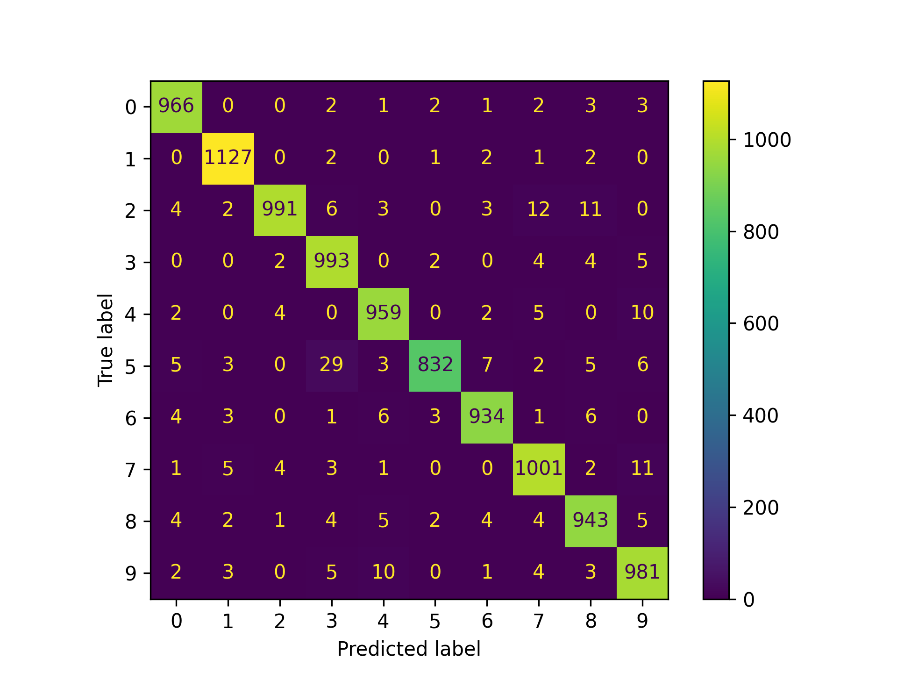
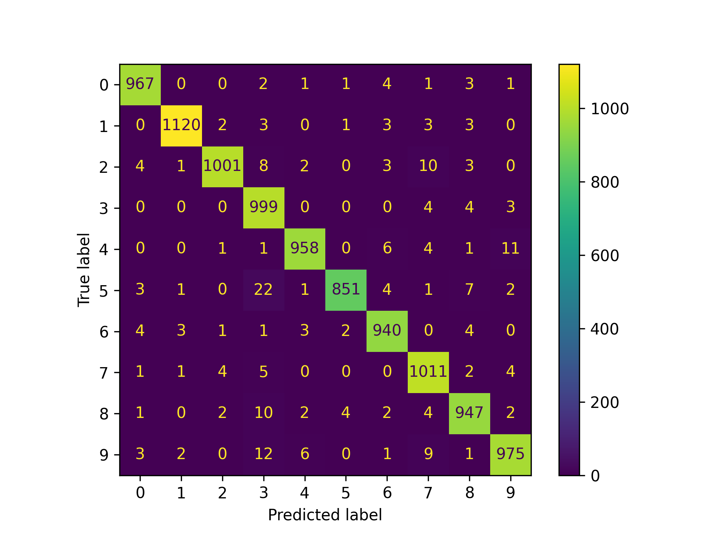

# CSCE 790 Neural Networks and Their Applications Homework 1 Report

Author: Titon Barua <baruat@email.sc.edu>

## Probem 1: MNIST Classifier

The code is available [here](https://github.com/titonbarua/coursework--csce790/blob/main/problem_1/mnist_classifier.py). On top of the code described in the blogpost, I added some basic evaluation metrics. I also trained a second network with double the neurons for each layer. Both of the networks were trained for 15 epochs.

With the second network, there was a slight improvement (0.42%) in overall classification accuracy. But there were some drops in precision and recall for some of the classes. With just 15 epochs of training, it is hard to assign any meaning to this fluctuations in precision and recall.

### Network with \(128, 64\) neurons in hidden layers

- Average validation accuracy is 97.27%

Table: Precision and recall by class for first network

|Digit|0|1|2|3|4|5|6|7|8|9|
|:-----|-|-|-|-|-|-|-|-|-|-|
|Precision %| 97.8|98.4|98.9|95.0|97.1|98.8|97.9|96.6|96.3|96.1|
|Recall %| 98.6|99.3|96.0|98.3|97.7|93.3|97.5|97.4|96.8|97.2|

### Network with \(256, 128\) neurons in hidden layers

Table: Precision and recall by class for second network

|Digit|0|1|2|3|4|5|6|7|8|9|
|:-----|-|-|-|-|-|-|-|-|-|-|
|Precision %|98.4|99.3|99.0|94.0|98.5|99.1|97.6|96.6|97.1|97.7|
|Recall %|98.7|98.7|97.0|98.9|97.6|95.4|98.1|98.3|97.2|96.6|

### Code Flow

- Download MNIST dataset from internet.
- Normalize the data and split them into batches.
- Build a fully connected neural network with this layering:
  - A fully connected layer
  - ReLU activation
  - Another fully connected layer
  - ReLU activation
  - Last fully connected layer
  - Softmax function convert the network output as probablities.
- Train the model using training data and save the model in the disk.
- Predict validation set and convert prediction from probabilities
  to class label by taking the argument of maximum probability.
- Evaluate performance using utilities from `scikit-learn.metrics` library.

<!--
Network: 128x64
Average accuracy: 0.9727
Precision:
	Class '0': 0.978
	Class '1': 0.984
	Class '2': 0.989
	Class '3': 0.950
	Class '4': 0.971
	Class '5': 0.988
	Class '6': 0.979
	Class '7': 0.966
	Class '8': 0.963
	Class '9': 0.961
Recall:
	Class '0': 0.986
	Class '1': 0.993
	Class '2': 0.960
	Class '3': 0.983
	Class '4': 0.977
	Class '5': 0.933
	Class '6': 0.975
	Class '7': 0.974
	Class '8': 0.968
	Class '9': 0.972

Network: 256x128
Average accuracy: 0.9769
Precision:
	Class '0': 0.984
	Class '1': 0.993
	Class '2': 0.990
	Class '3': 0.940
	Class '4': 0.985
	Class '5': 0.991
	Class '6': 0.976
	Class '7': 0.966
	Class '8': 0.971
	Class '9': 0.977
Recall:
	Class '0': 0.987
	Class '1': 0.987
	Class '2': 0.970
	Class '3': 0.989
	Class '4': 0.976
	Class '5': 0.954
	Class '6': 0.981
	Class '7': 0.983
	Class '8': 0.972
	Class '9': 0.966
-->

### Problem 2: Perceptron Response Graphs

Graph generating code is available [here](https://github.com/titonbarua/coursework--csce790/blob/main/problem_2/plot.py).

### Problem 3: CNN from Scratch

### Problem 4: Learning Techniques

**Hebbian learning** is a biologically inspired learning rule. The core concept is that, given some randomly initialized neurons, if some training data activates two connected nodes simultaneously, their connecting weights should be enforced or increased. This iterative strengthening eventually leads to strong clustering of the hidden and output neurons.

**Perceptron update rule** is a method of training a single perceptron. The
  perceptron starts with zero or randomly initialized weights and bias. For each
  training sample, the difference between desired output and the current output
  is calculated. Until convergence, weights are updated in proportion to both
  the error and the input feature. The bias is updated only in proportion to the
  error. This training method fails if the data is not linearly separable.

**Delta learning rule** is a method of training a perceptron. The weights are
  iteratively updated in proportion to the negative of the gradient of the least
  square error of the perceptron output. In case of a non-linear data-set, delta
  learning produces a linear separation that minimizes the least square error.
  Delta learning is the precursor to gradient descent which is the most
  practical neural network training approach.

**Correlation learning rule** is a modification of hebbian learning. In contrast
  to hebbian learning, which clusters the neurons in an unsupervised manner,
  correlation learning updates the output neurons to produce desired outputs in
  a supervised setting.

**Out Star learning rule** is a learning rule for layers of neurons. To my
understanding, weights are updated in a bottom-up fashion where output neurons'
drive the weights of the synaptic connections. The article does not go into
mechanistic details of the procedure and the resources on the web related this
method is rare.

**Competitive learning rule** is an approach where instead of updating the
weights, the learning happens by selecting output neurons with strongest
responses. The network is initialized with random weights and biases. For a
class of inputs, the output neuron with the maximal response is declared the
winner and assigned to that particular class. The weights of the specific neuron
is then updated to further strengthen it's response that class.

\pagebreak

### Problem 7: Linearity Test

A function $f: \mathbb{R}^n \rightarrow \mathbb{R}^m$ is linear if and only if for all $a \in \mathbb{R}$,

$$
\begin{split}
f(ax) &= a f(x)\\
f(x + y) &= f(x) + f(y)
\end{split}
$$

**a)** For $p \in \mathbb{R}^+$,

$$
\begin{split}
f(-px) &= |-px|\\
       &= |-p||x|\\
       &= p|x|\\
-p f(x) &= -p |x|
\end{split}
$$

Since $-p|x| \neq p|x|$, this function $f(x) = |x|$ is not linear.

**b)** For $x, y \in \mathbb{R}$,

$$
\begin{split}
f(x + y) &= (x + y)^2 + 2.(x + y) + 2\\
         &= x^2 + 2.xy + y^2 + 2x + 2y + 2\\
f(x) + f(y) &= x^2 + 4x + 2 + y^2 + 4y + 2\\
            &= x^2 + y^2 + 4x + 4y + 4
\end{split}
$$

Clearly, $f(x + y) \neq f(x) + f(y)$. Hence, $f(x) = x^2 + 2x + 2$ is not linear.

**c)** For $x, y \in \mathbb{R}; x \neq 0 ; y \neq 0$,

$$
\begin{split}
f(x + y) &= \frac{1}{x + y}\\
f(x) + f(y) &= \frac{1}{x} + \frac{1}{y}\\
            &= \frac{y + x}{xy}\\
\end{split}
$$

Since $\frac{1}{x + y} \neq \frac{y + x}{xy}$ in general, we can conclude that $f(x) = \frac{1}{x}$ is not linear.
